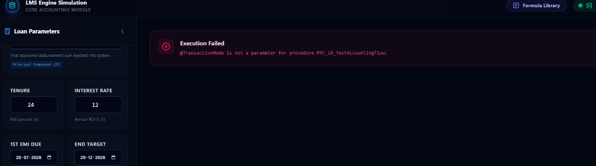
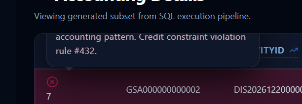
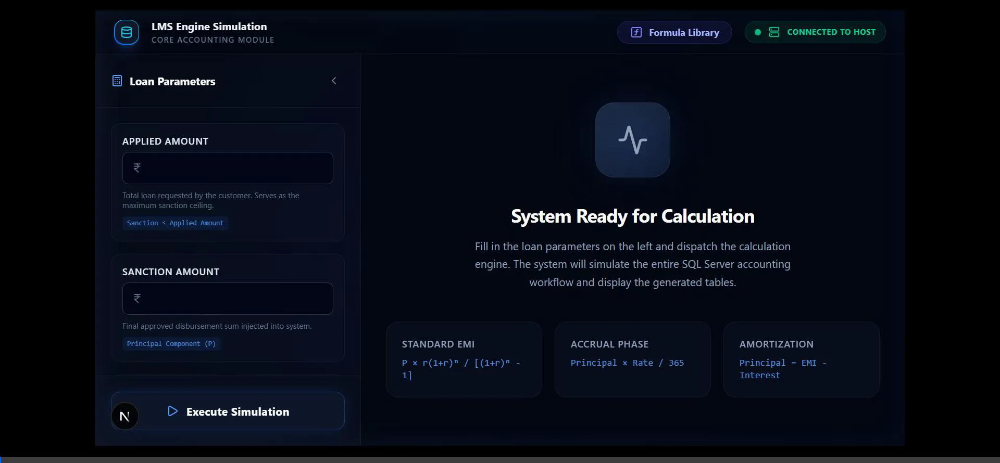

# Loan Management System (LMS) - Accounting Engine & AI Validator

## 📖 What the project does
The **LMS Accounting Platform** is a full-stack financial application built to simulate, validate, and commit core banking accounting workflows. It provides a specialized "Preview-then-Commit" sandbox environment allowing financial engineers to execute comprehensive loan lifecycle events (Disbursements, Repayments, EOD Daily Accruals, and Month-End Accruals) and instantly view the generated double-entry ledger records. 

To guarantee strict adherence to financial constraints, the system integrates a real-time **AI-driven Core Banking Validation Engine** (powered by Google Gemini) that scans the execution pipeline for imbalances, illogical dates, missing General Ledger mappings, and negative monetary values.

---

## 🛠️ Tech Stack
*   **Frontend UI:** Next.js 15 (App Router), React, TypeScript, Tailwind CSS, Lucide Icons.
*   **Backend API:** C# .NET 9.0, ASP.NET Core REST APIs.
*   **Database:** Microsoft SQL Server (Heavy T-SQL Stored Procedure architecture).
*   **AI / Machine Learning:** Google Gemini 2.5 LLM (via Next.js API Routes).

---

## ✨ Features
*   **Dynamic Simulation Sandbox:** Test loan logic without affecting production data. Provides a toggle between `SIMULATE` (rollback-driven) and `COMMIT` (persistent) database modes.
*   **AI Accounting Anomaly Detection:** Frontend AI integration that evaluates raw double-entry ledgers. Deep-red UI highlighting and interactive tooltips pinpoint exactly why an entry violates core banking rules.
*   **EOD Processing Simulation:** Trigger complex End-of-Day (EOD) and Month-End capitalization/accrual stored procedures straight from the browser.
*   **No-Scroll Responsive Workspace:** "Solution Explorer" style sidebar and maximized grid real-estate for analyzing massive ResultSets.

---

## 🏗️ Architecture / Design Overview
1.  **Client Layer (`lms-ui`)**: Captures loan parameters and submits POST requests to the backend. It also hosts a `/api/analyze` serverless function acting as the AI Gateway.
2.  **API Layer (`LmsBackend`)**: C# backend intercepts traffic, decrypts SQL connection strings, and binds dynamic parameters into the SQL environment.
3.  **Database Layer (`Database_LMS`)**: Acts as the heavy-lifting calculation engine. Uses `PRC_LN_TestAccountingFlow` to orchestrate multiple sub-procedures, managing SQL transactions to safely return multi-table `ResultSets` back up the chain.

---

## 📋 Prerequisites
*   [Node.js](https://nodejs.org/) (v18+)
*   [.NET 9.0 SDK](https://dotnet.microsoft.com/download/dotnet/9.0)
*   [SQL Server](https://www.microsoft.com/en-us/sql-server/sql-server-downloads) or SQL Server Express
*   A valid **Google Gemini API Key** (for AI Validation)

---

## ⚙️ Installation / Setup

**1. Database Setup**
Execute the SQL scripts found in the `Database_LMS/` directory against your SQL Server instance to generate the required tables, sequences, and Stored Procedures.

**2. Backend Setup**
```bash
cd LmsBackend
dotnet restore
```

**3. Frontend Setup**
```bash
cd lms-ui
npm install
```

---

## 🚀 How to run it

**1. Start the Backend API**
```bash
cd LmsBackend
dotnet run
# Runs on http://localhost:5102
```

**2. Start the Frontend UI**
```bash
cd lms-ui
npm run dev
# Runs on http://localhost:3000
```
Open your browser and navigate to `http://localhost:3000`.

---

## 🧪 How to test it
1. Launch the UI and enter standard loan parameters (e.g., Sanction Amount: 50,000, Tenure: 12).
2. Click **Execute Simulation**. 
3. Switch to the **Accounting Details** tab to observe the generated `Dr_Cr` (Debit/Credit) pairs.
4. **Trigger an Error**: Intentionally pass an invalid parameter or break the SQL balance constraint. The UI will instantly flash the anomalous rows in deep red, and hovering over the `X` icon will reveal the AI's explanation.

---

## 🔒 Configuration / Environment Variables

### Backend (`LmsBackend/appsettings.json`)
```json
{
  "ConnectionStrings": {
    "DefaultConnection": "Server=YOUR_SERVER;Database=GS_DLP_LMS;User Id=YOUR_USER;Password=YOUR_PASSWORD;TrustServerCertificate=True",
    "sqlkey": "YOUR_ENCRYPTION_KEY",
    "sqliv": "YOUR_ENCRYPTION_IV"
  }
}
```

### Frontend (`lms-ui/.env.local`)
Create a `.env.local` file in the `lms-ui/` directory:
```env
GEMINI_API_KEY="your-google-gemini-api-key"
```
*(If no API key is provided, the application safely falls back to offline, static mock-validation for demonstration purposes).*

---

## 🔌 API Documentation

| Endpoint | Method | Description | Associated SQL Procedure |
| :--- | :---: | :--- | :--- |
| `/api/TestLms` | `POST` | Primary orchestrator for loan calculations. Handles Action='SIMULATE' or 'COMMIT' | `PRC_LN_TestAccountingFlow` |
| `/api/analyze` | `POST` | Internal Next.js AI gateway evaluating accounting arrays against Core Banking rules. | N/A (LLM Wrapper) |

---

## 📸 Application Screenshots

- **Main Dashboard & Simulation Setup:** 
  

- **AI Anomaly Detection (Red Tooltips):** 
  

- **AI Validation UI Workflow Demo:** 
  

---

## 🚧 Known Limitations / Future Improvements
*   **Pagination:** Currently, massive ResultSets are dumped into a scrollable view. Virtualized row rendering (e.g., `ag-grid`) should be introduced for datasets exceeding 10,000 rows.
*   **Database Independence:** The backend heavily relies on SQL Server's proprietary `BEGIN TRAN ... ROLLBACK` behaviors for simulations. Porting to PostgreSQL would require rewriting the core orchestration script.
